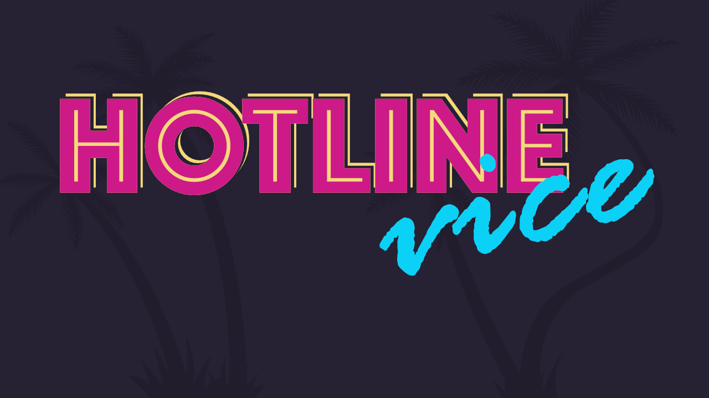
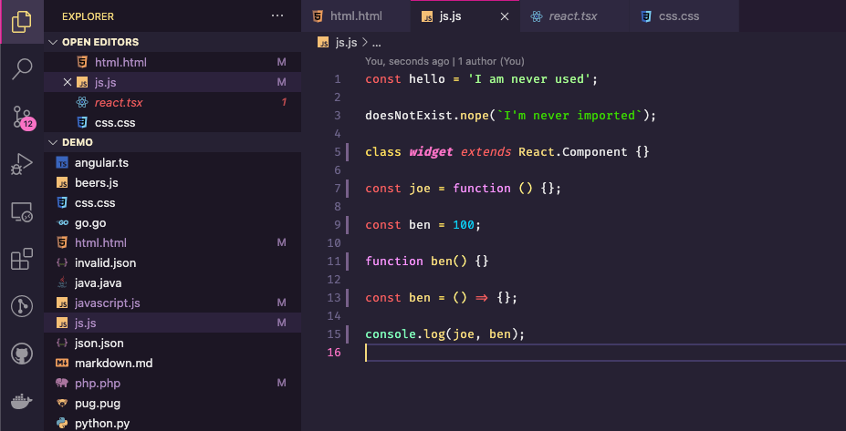

# Hotline Vice - VS Code Theme

A Visual Studio Code theme for the lovers of neon and loud colours.

The idea for the theme comes from my love for Hotline Miami, GTA Vice City, and the colours of neon lights.

## Installation

1. Install Visual Studio Code
1. Launch Visual Studio Code
1. Choose Extensions from menu
1. Search for `hotline vice`
1. Click Install to install it
1. Click Reload to reload the Code
1. From the menu bar click: Code > Preferences > Color Theme > Hotline Vice

## Misc

This is my first stab at making a theme so things might not be perfect. If you find a bug, feel free to [create an issue](https://github.com/b3nk3/hotline-vice-vscode-theme/issues).

I feel good about most of my colour choices, but some might change as I use this theme during regular dev.

I haven't tested for A11Y but I welcome suggestions that can enable more people to enjoy this theme.

## Credits

The colour base for the theme was inspired by Robb Owen's [Synthwave '84](https://marketplace.visualstudio.com/items?itemName=RobbOwen.synthwave-vscode)

I also pinched the demo folder from [Wes Bos](http://twitter.com/wesbos)'s [Cobalt 2 theme](https://github.com/wesbos/cobalt2-vscode), that has been a great help for tokenization.

Lastly, thanks to [Sarah Drasner](https://twitter.com/sarah_edo) for her great [article](https://css-tricks.com/creating-a-vs-code-theme/).
